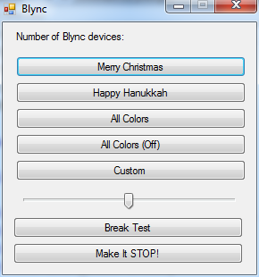
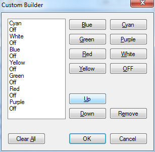

BlyncLight
==========

Messing around with the [BlyncLight SDK](http://blynclight.proboards.com/thread/2/blync-sdk-create-own-applications)

Two simple projects, BlyncN which just flashes the colors and allows you to create a custom "recipe" and BlyncNotes, uses Console.Beep to play a note when the color changes

BlyncN
------

The main screen which shows some built in "recipes", a speed slider and a Stop button

A simple custom recipe builder screen

Blync Notes
-----------

Nothing pretty, but it plays jingle bells

###Side Note
December 26, 2013 my boss gave me a BlyncLight, then mentioned the SDK and I was in the holiday spirit hence the holiday references.
